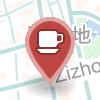
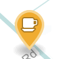
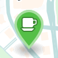

# Awesome Bay Area Café

Awesome café places in Bay Area with ~~fast Wi-Fi and~~ good coffee. Markers with different colors are used for different download speed.

Inspired by [awesome-cn-cafe](https://github.com/ElaWorkshop/awesome-cn-cafe).

<table>
<tr><th>Marker</th><th>Download Speed</th></tr>
<tr><td></td><td>0 ~ 5 Mbps</td></tr>
<tr><td></td><td>5 ~ 10 Mbps</td></tr>
<tr><td></td><td>10+ Mbps</td></tr>
</table>

## Contribution

Pull requests for awesome coffee shops are welcome! Please use [Speedtest](http://speedtest.net) or other tools to measure network speed, then add to the [geoJSON](http://geojson.org/geojson-spec.html) file.

### Getting Location

Because GitHub’s geoJSON support is powered by Mapbox, Using [Mapbox](https://www.mapbox.com/mapbox.js/example/v1.0.0/select-center-form/) is the most accurate way to get latitude and longitude.

## License
[CC-BY](http://creativecommons.org/licenses/by/4.0/)
